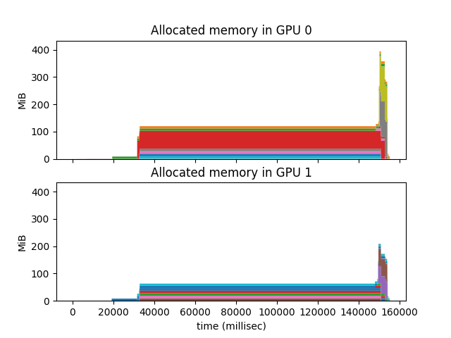

(Work-in-progress)

# Memory Usage Tool

This is a tool that queries how much memory is being used in a GPU every `N`
milliseconds. 
The tool uses [NVML](https://developer.nvidia.com/nvidia-management-library-nvml)
and it runs in parallel with the model being profiled, running 
[this query](http://developer.download.nvidia.com/compute/DevZone/NVML/doxygen/structnvml_memory__t.html)
every millisecond. It then writes to a file 

This tool does not require any modification of ORT code. In fact, it can be used
to profile, for example, models written in PyTorch. 

## How to use the tool
1. Run `make` to compile the code in `profile_total_memory_usage.cpp`.
2. Run `./profile_total_memory_usage -o <output_file> -i <N>` in parallel with 
the execution of a model/program that runs on the GPU. 

`profile_total_memory_usage` will run until it is interrupted by a `SIGINT` 
signal. A simple way of running the tool in parallel with the model is with
the `memprof` script:

```
python memprof.py -o tiny_bert.txt -- ~/src/onnxruntime/build/Linux/Debug/onnxruntime_training_bert <bert arguments>
```

The `profile_total_memory_usage` tool writes to `output` the memory information
it requests from NVML and each query results in one line of the form:
```
<device id> <time since start of execution> <total memory allocated in bytes>
```

We also include a Python utility to plot the information obtained. Simply run
`python plot.py --memory-usage-file <output> --usage-output <my_plot_file>` to
obtain a file `my_plot_file.png`

### Example 1:
Running 1 training step of bert tiny in a machine with two P100 GPUs, and 
plotting the memory usage results.


```
python memprof.py -o tiny_bert.txt -- <path/to/onnxruntime_training_bert> --model_name <path/to/bert-tiny/onnx/file>  --train_data_dir <path/to/train/data/dir> --test_data_dir <path/to/test/data/dir> --train_batch_size 1 --mode train --display_loss_steps 1 --optimizer lamb --learning_rate 0.006 --gradient_accumulation_steps 1 --num_train_steps 1 --warmup_ratio 0 --warmup_mode Linear --use_nccl
```
```
python plot.py --memory-usage-file tiny_bert.txt --usage-output tiny_bert
```

#### Result


The x-axis shows time in seconds and the y-axis shows memory usage in MiB. 
*Note:* Although the model runs on 1 GPU, it seems that the runtime allocates
some metadata in the second GPU available.


### Example 2:
Running 1 training step of bert tiny, with pipeline parallelism =2, in a
machine with two P100 GPUs, and plotting the memory usage results.

```
python memprof.py -o bert_tiny_pp2.txt -- mpirun -n 2 <path/to/onnxruntime_training_bert> --model_name <path/to/bert-tiny/onnx/file>  --train_data_dir <path/to/train/data/dir> --test_data_dir <path/to/test/data/dir> --train_batch_size 1 --mode train --display_loss_steps 1 --optimizer lamb --learning_rate 0.006 --gradient_accumulation_steps 1 --num_train_steps 1 --warmup_ratio 0 --warmup_mode Linear --use_nccl --pipeline_parallel_size 2 --cut_group_info 418
```
```
python plot.py --memory-usage-file bert_tiny_pp2.txt --usage-output bert_tiny_pp2
```

#### Result:


### Example 3:
Running 1 training step of bert tiny wtih two different allocation strategies: kNextPowerOfTwo and kSameAsRequested.

#### kNextPowerOfTwo:
 

#### kSameAsRequested:


# Memory Allocation

A different option to profile memory usage is using `nvprof --track-memory-allocations on`. This seems to add some overhead to the execution time though.

In order to profile Example #2 above (bert tiny with pipeline parallelism of 2), we can run: 
```
nvprof --profile-child-processes --track-memory-allocations on -o allocs_2devices_1step%p.prof -- mpirun -n 2 <path/to/onnxruntime_training_bert> --model_name <path/to/bert-tiny/onnx/file>  --train_data_dir <path/to/train/data/dir> --test_data_dir <path/to/test/data/dir> --train_batch_size 1 --mode train --display_loss_steps 1 --optimizer lamb --learning_rate 0.006 --gradient_accumulation_steps 1 --num_train_steps 1 --warmup_ratio 0 --warmup_mode Linear --use_nccl --pipeline_parallel_size 2 --cut_group_info 418
```

This will generate two files named `allocs_2devices_1step*.prof`: one for each 
process.

Note: in one of the profiling files, it seems that one of the processes 
allocates in both GPUs. Is this the 2 MiB we see in the memory usage plots? 
TODO: investigate this.

In order to plot the resulting profiling information, we can use the same 
plotting script from above:
```
python plot.py --memory-allocation-files allocs_2devices_1step5110.prof allocs_2devices_1step5111.prof --allocation-output allocs_2devices_1step
```

#### Result

 

Each color shows a memory allocation. The x-axis shows in milliseconds, when the
allocation and the respective free happened. The y-axis shows in MiB the size of
the allocation.