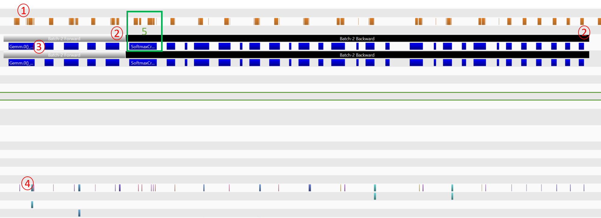

[Work in Progress]

This utility tool gathers profiling information of individual operations, by correlating each operator with the GPU kernels it executes.

When running the sequential executor, it will emit NVTX annotations for each operator it executes ([PR5542](https://github.com/microsoft/onnxruntime/pull/5542)). For that we need to build onnxruntime with the option `--enable_nvtx_profile` and to prepend `nvprof -o profile.prof --` to the command used to train/run a model, or `nvprof --profile-child-processes -o profile%p.prof` when using multiple processes. This will generate one, or more, .prof files, which are essentially SQL data bases filled with CUPTI profiling information. The tool [gather_op_profile](.gather_op_profile.py) queries these databases to collect GPU kernel information about each operator. 

At the moment, we gather for each operator a list of all the kernels it executes, and for each kernel:
* name of the kernel,
* start and end timings (in nanoseconds),
* number of registers per thread, and
* stream id.

However, these are just examples. The .prof files contain much more information: https://docs.nvidia.com/cupti/Cupti/annotated.html#structCUpti__Activity.

## Example: 

In order to profile one training step of [mnist](https://github.com/microsoft/onnxruntime/tree/master/orttraining/orttraining/models/mnist), we can run the following command:  
```
nvprof -o profile.prof -- onnxruntime_training_mnist --model_name mnist_gemm --train_data_dir mnist_data --log_dir logs/  --num_train_steps 1 --use_cuda --use_profiler
```

This generates a `profile.prof` file, which we then pass as input to the `gather_op_profile`.

```
python gather_op_profile.py --input_prof_file profile.prof --output_json_file profile.json
```

The file `profile.json` groups operators by forward and backward, and each operator contains a list of kernels it executes, as shown below.

```
"forward":[
  {
    "Gemm.0()": [
      {
        "duration(ns)": 1504,
        "end": 1604057753808890056,
        "n_registers_per_thread": 16,
        "name": "void onnxruntime::cuda::_Fill<float, 256, 4>(float*, float, int)",
        "start": 1604057753808888552,
        "stream_id": 7
      },
      {
        "duration(ns)": 5408,
        "end": 1604057754097275559,
        "n_registers_per_thread": 18,
        "name": "void gemmk1_kernel<float, 256, 5, false, false, false, false, cublasGemvTensorStridedBatched<float const>, cublasGemvTensorStridedBatched<float>, float>(cublasGemmk1Params<float, cublasGemvTensorStridedBatched<float const>, cublasGemvTensorStridedBatched<float>, float, biasType<cublasGemvTensorStridedBatched<float>::value_type, float>::type>)",
        "start": 1604057754097270151,
        "stream_id": 7
      },
      {
        "duration(ns)": 15328,
        "end": 1604057754119920700,
        "n_registers_per_thread": 82,
        "name": "volta_sgemm_64x32_sliced1x4_nn",
        "start": 1604057754119905372,"stream_id": 7
      },
      {
        "duration(ns)": 4448,
        "end": 1604057754119929244,
        "n_registers_per_thread": 32,
        "name": "void splitKreduce_kernel<float, float, float, float>(cublasSplitKParams<float>, float const*, float const*, float*, float const*, float const*, float const*)",
        "start": 1604057754119924796,"stream_id": 7
      }
    ],
    ....
```

## How does it work?

Let us take a look at the profiling information for one training step (screenshot from nvvp tool). 


We can observe the following information:
1. cuda launches;
2. NVTX markers for the executions of forward and backward phases; 
3. Operators; and
4. CUDA kernels running on the GPU. 

The first step is to get a correlation between cuda launches (1) and kernels (4) using [this API](https://docs.nvidia.com/cupti/Cupti/annotated.html#structCUpti__ActivityAPI_131ebcf7b922b23850c6c85a9d5157b0d). Then, for each operator (3), we look at all the cuda launches (1) that happen in the same time window, i.e., all the cuda launches with a starting time greater or equal to the starting time of the operator and with an endind time smaller or equal to the ending time of the operator. We consider the kernels that correlate with these cuda launches are caused by the operator. Finally, the set of operators (3) that belong to a forward/backward phase (2) are those that run in the same time window.

### TODO

* Testing this tool with more models
* Add more information to the JSON file about what is going on in the cpu too. 
* Can we specify which training step(s) to profile?
* Can we use focused profiling? 
  - https://docs.nvidia.com/cuda/profiler-users-guide/index.html#focusing-profiling
* Try the tool with a model running with more than one mpi rank. In theory, this should work file, because each process will generate an independent .prof file.
* This is assuming execution with Sequential Executor. What happens when using the Parallel executor?
* Will this work well with multi-stream execution?